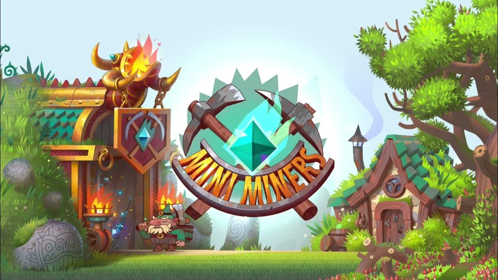

The Smartcontracts of the [MiniMiners](https://miniminersgame.com/), the p2e earn on Sui Blockchain.

> Addresses of the deployed resources:
> [ADDRESS](./ADDRESSES.md)

---

# Installation
It requires [sui](https://sui.io/) to be installed on your machine.

If you didn't install sui, install it using:

```powershell
cargo install --git https://github.com/MystenLabs/sui.git `
 --branch testnet sui --force
```

Upon installation complete, type on terminal:

```powershell
sui -V
```

If you see the sui version printed, then go to the next step.


## Link to the Sui
The *MiniMiners* smartcontracts utilize `sui` and `std` library packages. Those packages are installed with the sui client.

In this repository, open the `Move.toml` in the root folder.
In the `[dependencies]` section set the correct path to Sui packages:

```toml
Sui = { local = "../sui/crates/sui-framework" }
```

The **sui** code will be installed to the `<user folder>/sui`.

*For example on Windows:*
*`C:\Users\<user name>\sui`.*

That means, sui packages will be in `C:\Users\<user name>\sui\crates\sui-framework`.

### Error handling
*If the `sui publish` command gives **a client-server version mismatch** error, then you should install the exact version:*

```powershell
cargo install --git `
https://github.com/MystenLabs/sui.git `
--tag devnet-0.27.1 sui --force
```

---
## Build

```powershell
sui move build
```

Compile the smartcontract source code to the binary.


> :warning: Warning 
> If you didn't see the output as on the screenshot above, then the code is malformed. Contact me: [admin@blocklords.io](mailto:admin@blocklords.io)

---

## Test

```powershell
sui move test
```

Run the tests


> :warning: Warning
> If you didn't see the output as on the screenshot above, then the code is malformed. Contact me: [admin@blocklords.io](mailto:admin@blocklords.io)

---

#Deploy

Deploy the smartcontracts on the blockchain.

```powershell
sui client publish --gas-budget 3000 --dev --doc --abi 
```

*If it shows an error `Multiple source verification errors found:`*

Then add to the command another argument after `--abi`:

```powershell
--skip-dependency-verification
```

Upon successful publishing, the console output will show
Transaction Hash. Then we need to update the game backend to work with the newly published data.

#####Steps to do to update the game
Go to the explorer, to the page of the transaction.
The explorer will show the list of the created objects.
Go to each object to identify the Object Type.

**1. Update the config.json on CDN.**
For now for demo we keep the cdn on the backend as hardcoded config.
Its hardcoded in the `src/app.js`. Find the `sui_dev_config` variable in the source file. And set the write parameters.

**2. Update the sync bot**
In the repository of the sync bot, update the `config/config.json`

> Done! Now you can call the following commands to test it.

---

####Mint new MineNFTs
*Can be called by the owner of `NftFactory` object.*
*By default its the publisher of the package.*

```powerpowershell
sui client call `
 --function mint `
 --module mine_nft `
 --package 0x1f9f5ea685a87c1bc72ccf16092dc659c1b62f56 ` --gas-budget 1000 `
 --args `
  		0x68cd72eb93b5894af90edc84591cf43c0c4d4c1d `
  0x8714a9b7819e42cedbde695f9a0242b7d79ff9c2 `
  2 `
  3
```

The first argument is the resource(aka object) id of the Factory. The second argument is the owner of the nft.
The last two arguments are generation and quality.

Mint an `MineNFT` with `generation = 2` and `quality = 3`. The minted nft is transferred to `0x8714a9b7819e42cedbde695f9a0242b7d79ff9c2`.

---

##### Transfer Nft

```powershell
sui client transfer --to 0x8ec7ccb4e3925fef987d8a2ff11f78051e0ffc46 `
--object-id 0xbd1479055f0f091123d245b7ad4ebb95ef80b9cb `
--gas-budget 3000
```

---

##### Transfer SUI to Game smartcontract
In order to test selling gold packs in exchange
for crypto token, we need to have some token
in the smartcontract

```powershell
sui client call `
--function transfer_token `
--module game `
--package 0x1f9f5ea685a87c1bc72ccf16092dc659c1b62f56 `
--gas-budget 1000 `
--type-args 0x2::sui::SUI `
--args `
  0x1798b2bbe3db25d746cffa8a343f0840c85a99d8 `
  0x5e65827ec1c3f391d543c53d702f4377e8f30a18
```

Type argument of the coin is `0x2::sui::SUI`.
The first argument is the shared game object id.
The second argument is the SUI object id.

---

#### Buying Gold

Lets test selling `1500000` of gold for 0.1 SUI.

**gold_id** = **101**

```powershell
sui client call `
--function sell_gold `
--module game `
--package 0x1f9f5ea685a87c1bc72ccf16092dc659c1b62f56 `
--gas-budget 1000 `
--type-args 0x2::sui::SUI `
--args `
  0x1798b2bbe3db25d746cffa8a343f0840c85a99d8 `
  0x4f44f0122e3577acdcacae1f1e44a1ef8a036a29 `
  9991804 `
  101
```

The first argument is the address of the shared game object.
The second argument is the address of the Coin of `--type-args` type. The price of the sold gold will be added to the value of the passed coin object.
The third argument is the amount of tokens in `MIST`

> 1 MIST = 10e-9 SUI
> One SUI is equal to 1 billion MIST

The last argument is the pack id. In our case its the gold pack.

---

#### Buy Pack

Let's test purchasing `Diamonds` for `0.002 SUI`.

0.002 SUI = 2_000_000 MIST (2 million)

`60 Diamonds pack id = 1`

```powershell
sui client call `
--function buy_pack `
--module game `
--package 0x1f9f5ea685a87c1bc72ccf16092dc659c1b62f56 `
--gas-budget 1000 `
--type-args 0x2::sui::SUI `
--args `
  0x1798b2bbe3db25d746cffa8a343f0840c85a99d8 `
  0x4f44f0122e3577acdcacae1f1e44a1ef8a036a29 ` 
  1
```
> Do not pass the first SUI object as the function argument. That object is used by that wallet to pay for transaction fee.

The first argument is the shared game object. The second argument is the object id of `--type-args` type. The amount should be equal to the 2 million MIST.
The third and last argument is the pack id.

##### Getting the object id of 0.002 SUI

We need to list the all objects that user has

```powershell
sui client objects
```

If we don't find the amount that's worth 0.002 SUI we split the first object with 0.02 gas.

```powershell
sui client split-coin `
--gas-budget 1000 `
--amounts 2000000 `
--coin-id 0xe8854a583350f445f552fe7354d9ea0cdc26b459
```

Then use the created object for buying pack.

---

#### Import NFT

```powershell
sui client call `
  --function import_nft `
  --module game `
  --package 0x8bfc690e84558814aaab3f2f6755e18f0f59217d `
  --gas-budget 3000 `
  --type-args 0x8bfc690e84558814aaab3f2f6755e18f0f59217d::mine_nft::Mine `
  --args `
    0xbfd3f36b2ea108333cde4b2558c64d95dd6172dd `
    0x9d233fe1481b001c34a2f13893b87046cf1d0570 `
    1678367370 `
    0x0c4e96924cda5b54954e96a7fa1c44b5a95a42659e0ebcb40e5ded78bb0e67a46c99fbb032040234b372e193ec6c3a50300453b8e377e357562285093b69afa100
```

The first argument is the shared game object. The second argument is the coin object id. The tokens from smartcontracts will be added to the second argument.

`0xbfd3f36b2ea108333cde4b2558c64d95dd6172dd`: is the shared game object.
`0x9d233fe1481b001c34a2f13893b87046cf1d0570` argument is the nft id.
`1678367370` is the Unix timestamp returned by the server.
The last parameter is the signature returned by the server.

---

## Sui tutorials

The list of references used in the writing of these smartcontracts:

* https://github.com/MystenLabs/sui &ndash; source code with all links to start to work with Sui blockchain.
* https://docs.sui.io/devnet/explore &ndash; primary hub of the documentations.
* https://github.com/MystenLabs/sui/blob/main/doc/src/explore/examples.md &ndash; primary hub of the examples.
* https://github.com/MystenLabs/sui/blob/main/sui_programmability/examples/nfts/sources/marketplace.move &ndash; NFT marketplace, used to see how to import/export NFT into MiniMiners game smartcontract.
* https://github.com/MystenLabs/sui-axelar/blob/2a0f17ab8efdb8ebc6bca753328180a02f6fcf6e/presets/index.js#L108 &ndash; example on how to generate the signatures offchain, then verifying them on-chain using `ecrecover` function.
* https://github.com/MystenLabs/sui/tree/main/sdk/typescript/ &ndash; the SDK to interact with Sui blockchain from Node.js and browser backends.
* https://move-language.github.io/move/vector.html &ndash; Move programming language book. The link is the page describing array like data structures: vectors.
* https://github.com/MystenLabs/sui/blob/main/doc/src/build/install.md#sui-tokens &ndash; How to obtain devnet SUI token.
* https://explorer.sui.io/ &ndash; explore the blocks and transactions.
* https://github.com/move-language/move/tree/main/language/documentation/tutorial &ndash; official tutorial on move programming language.
* https://github.com/MystenLabs/awesome-move#move-powered-blockchains &ndash; list of useful recource collection related to Move programming language.